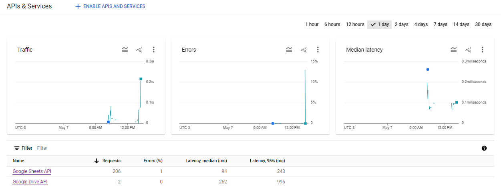

# Automação de Processo de RH com Google Cloud e Google Drive API
Este projeto visa automatizar processos de Recursos Humanos (RH) utilizando a integração com o Google Cloud e a Google Drive API. Com essa automação, é possível gerenciar dados de funcionários, como informações de contato, cargo, região e status, de forma mais eficiente e simplificada.

## Funcionalidades
- Adicionar novos funcionários ao sistema, incluindo dados como telefone, nome, cargo, região e status.
- Deletar funcionários existentes com base no nome.
- Conectar-se ao Google Cloud e à Google Drive API para armazenar e acessar os dados na nuvem.
  
## Como Utilizar
### 1. Configuração do Ambiente
- Certifique-se de ter uma conta no Google Cloud Platform.
- Crie um novo projeto no Google Cloud Platform e habilite a Google Drive API para esse projeto.
- Crie um arquivo JSON de credenciais para acesso à API e faça o download.
- Clone este repositório em sua máquina local.
  
### 2. Instalação das Dependências
- Instale as dependências do Python necessárias, como gspread, oauth2client etc.
- Você pode instalar as dependências utilizando o comando pip install -r requirements.txt.
  
### 3. Configuração das Credenciais
- Coloque o arquivo JSON de credenciais baixado do Google Cloud Platform na raiz do projeto.
- Certifique-se de configurar corretamente o caminho para o arquivo JSON de credenciais no código Python.
  
### 4. Execução do Código
- Execute o código Python fornecido.
- Utilize as funções fornecidas para adicionar novos funcionários, deletar funcionários existentes, entre outras funcionalidades.

Legenda: print do Dashboard da API Google Cloud

## Contribuição
Contribuições são bem-vindas! Se você encontrar algum problema ou tiver sugestões de melhorias, sinta-se à vontade para abrir uma issue ou enviar um pull request.